# Sekretariat dla e-dziennika.

## Funkcję dostępne:
1. Dodanie / edycja ucznia.
2. Dodanie / edycja rodzica.
3. Wyświetlanie listy uczniów które są przypisane do klas, oraz są jako kandydaci - brak klasy.
4. Wyświetlanie rodziców - powiązanych z uczniami, oraz nie powiązani z uczniami, także wszystkich opiekunów.
5. Wyświetlanie oddziałow w jednostkach, oraz wyświetlenie w nich planu lekcji, oraz listę uczniów.
6. Seryjnie dodanie do oddziału uczniów, usunięcie u nich ocen, frekwencji, usunięcie pobytu w szkole (historia przeniesień), zablokowanie dostępu do konta ucznia / rodzica.

## W planach zrobić:
1. Edycja konta nauczyciela.
2. Usunięcie konta nauczyciela.
3. Wyświetlenie dodatkowych danych, np: przydziały, ilość wystawionych ocen, zastępst przydzielonych, ilość nie zrealizowanych lekcji (brak tematu, oraz frekwencji).


## Uruchomienie aplikacji:
```
ng serve
```

----
Zalogowanie się do e-sekretariatu jest możliwe za pomocą e-dziennika, brak możliwości hostowania u siebie aplikacji.

----

1. Zarządzanie kontem ucznia:
- Dodawanie ucznia:
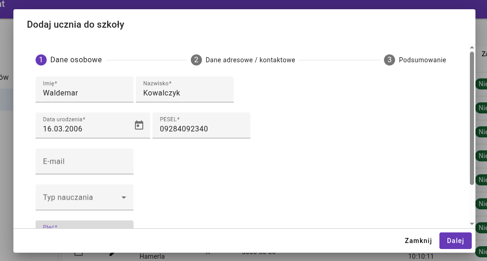
- Edycja ucznia 
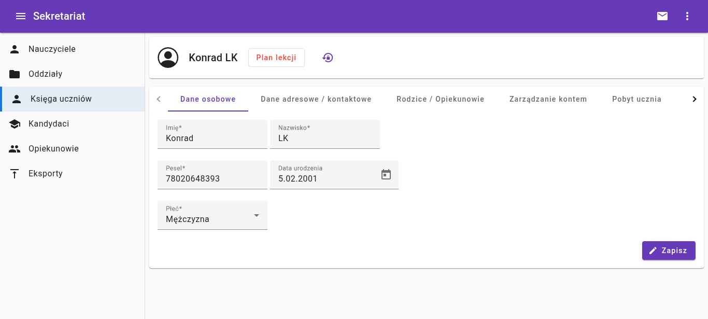
- Rodzice / opiekunowie ucznia:
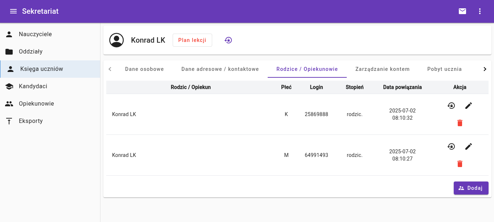
- Pobyt ucznia w szkole:
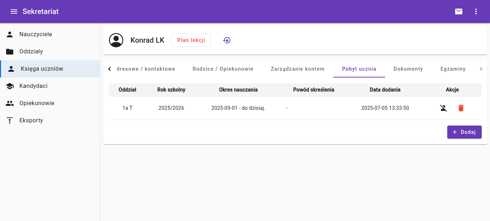
- Dodawanie rodzica:
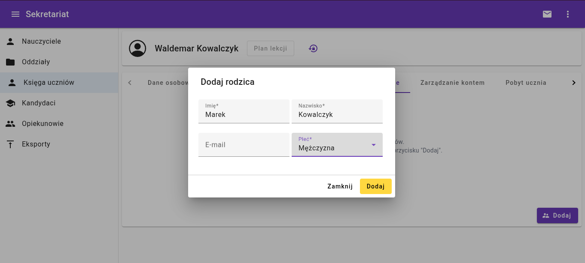
- Resetowanie hasła - rodzic / uczeń:
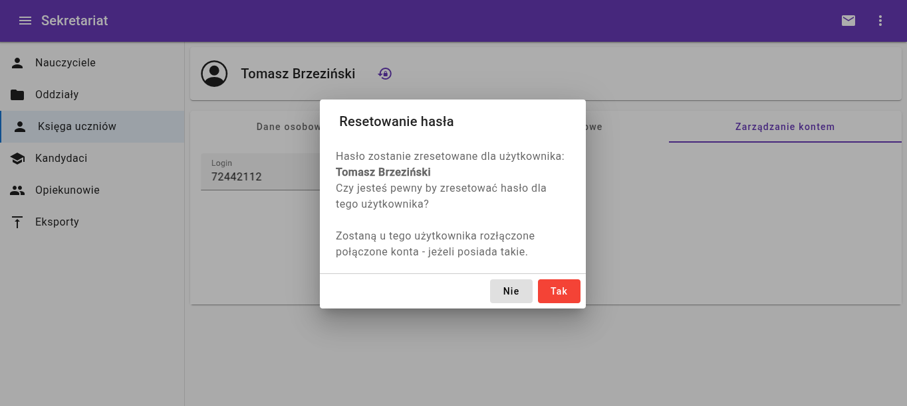
----
2. Oddziały:
- Lista oddziałów w jednostce:
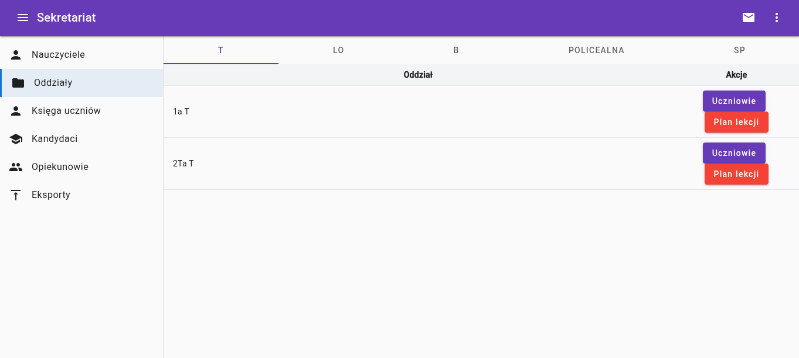
- Plan lekcji w oddziale:
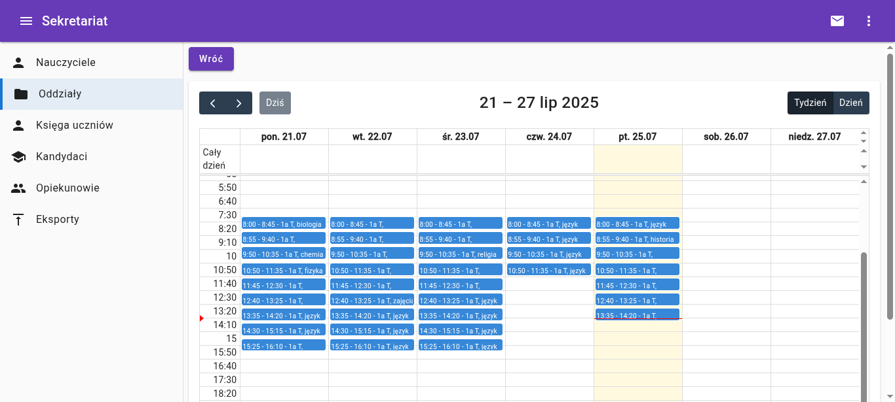
- Lista uczniów:
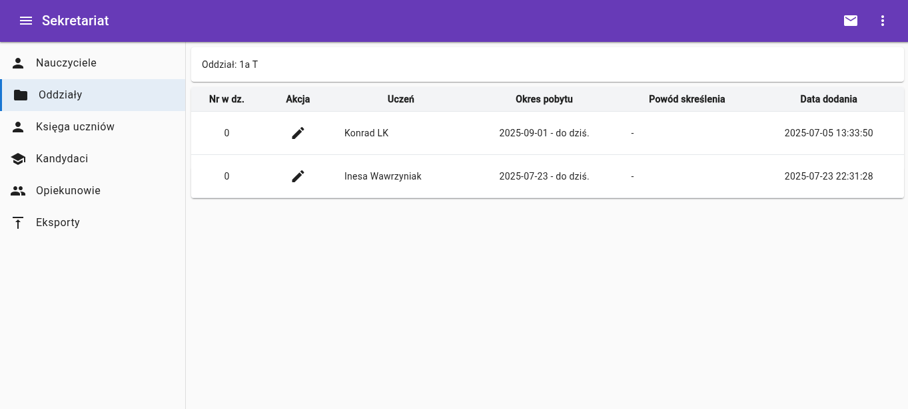
---
3. Opiekunowie / rodzice:
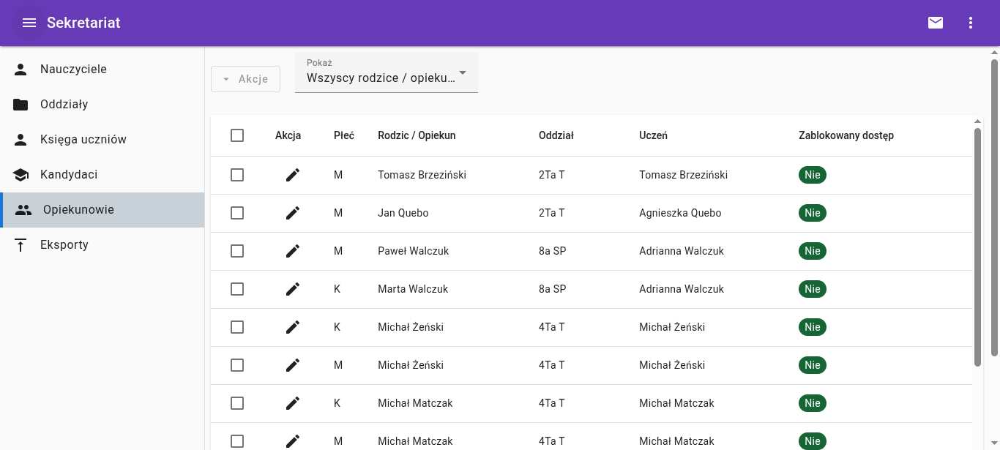
---
4. Kandydaci:
- Akcje które można wykonać:
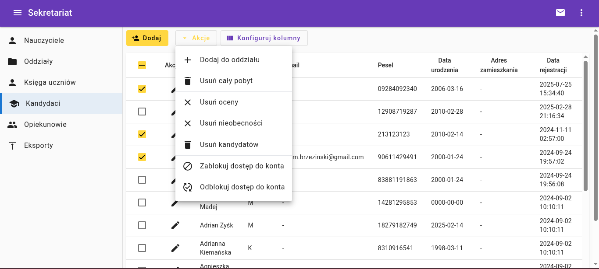